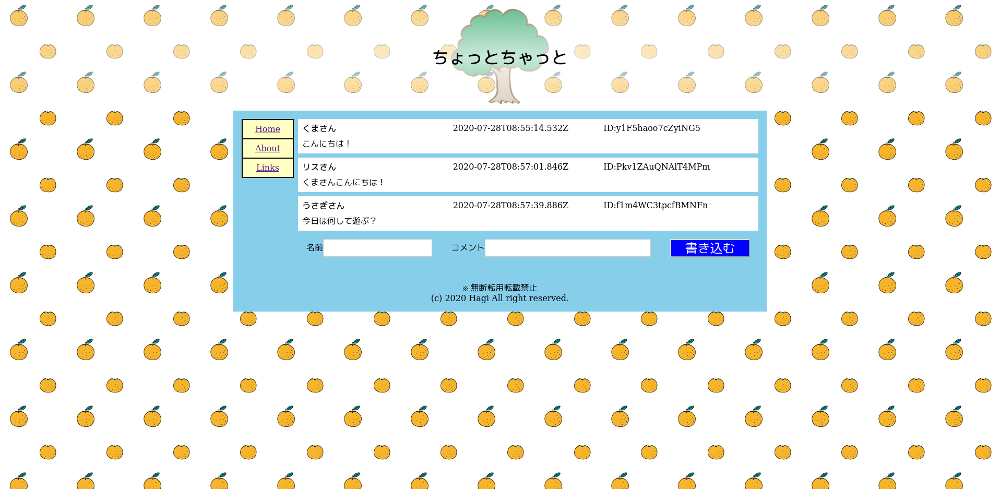

# ちょっとちゃっと



ちょっとだけチャットができるアプリケーションです。https://chat.polyomino.jp/ で
公開しています。

## 投稿とIPの管理

投稿は Firebase Callable Function `postChat` 経由で受け付けます。
`chat/{投稿ID}` に名前・本文・ID・サーバー日時を、`chatPrivate/{投稿ID}` に
接続元IPと記録時刻を一括保存します。ブラウザーからIPや日時は送信しません。
`database.rules.json` は `chat` の読み取りだけを許可し、全パスへのクライアントの
書き込みを禁止します。非公開データは管理者権限（Admin SDK / Firebase Console）で確認します。

- 名前は40文字以内（空文字は名無しさんとして表示）。
- コメントは1〜1000文字で、空白だけの投稿は禁止。
- IDは16桁の英数字。表示用であり、本人確認の根拠にはなりません。
- 同じIPからの投稿は10秒間隔。DBトランザクションで同時リクエストも制限します。
- 保存失敗時にも頻度制限の枠は消費します。10秒後に再試行できます。
- 同じネットワークの利用者は制限を共有します。IPの変更による回避は防げません。

IP取得は第1世代の `cloudfunctions.net` エンドポイントへの直接呼び出しを前提とし、
`X-Forwarded-For` の末尾（入口で追加される接続元）を使用します。
利用者が付けた先頭のIPは信用しません。エミュレーターではソケットの接続元を使用します。
独自プロキシやHosting経由に変更する場合は信頼する経路の見直しが必要です。
本番適用時は既知の接続元と偽装ヘッダー付きのリクエストで、実際の入口の挙動も確認してください。
[Cloud Functions のヘッダー仕様](https://docs.cloud.google.com/functions/docs/reference/headers)

IPと頻度制限データは自動削除しません。運用に合わせて保存期間を定め、管理者側で削除してください。

既存投稿のIPは移行済みで、`chatPrivate/{投稿ID}/legacyClientIp` に保存しています。
旧IPはクライアント申告値のため、新しいサーバー取得IPとは区別します。

### デプロイ

```sh
npx firebase deploy --only functions,hosting,database
```

### 検証

Node.jsが必要です。DBエミュレーターを起動する検証にはJavaも必要です。

```sh
npm run build-functions
npm run typecheck-app
npx firebase emulators:exec --only database --project demo-supercell 'node scripts/test-database-rules.cjs'
```

テストはデモDBを初期化し、公開/非公開アクセス、直接書き込み禁止、入力検証、
IPの正規化、公開/非公開データの紐付け、同時投稿の制限を確認します。

GitHub Actionsの本番デプロイは、非推奨の`FIREBASE_TOKEN`や長期保存するJSON鍵を使わず、
Workload Identity Federationで一時的な認証情報を取得します。
Google Cloud側でGitHubのOIDCプロバイダとデプロイ専用サービスアカウントを作成し、
対象リポジトリ・ブランチに限定してサービスアカウントの権限を委譲してください。
Actions secretsには、プロバイダ完全修飾名を`WORKLOAD_IDENTITY_PROVIDER`、
サービスアカウントのメールアドレスを`FIREBASE_DEPLOY_SERVICE_ACCOUNT`として登録します。
ワークフローにはOIDC用の`id-token: write`権限を設定済みです。

## 画像

- http://bg-patterns.com/?p=1770
- http://flode-design.com/?p=1273
